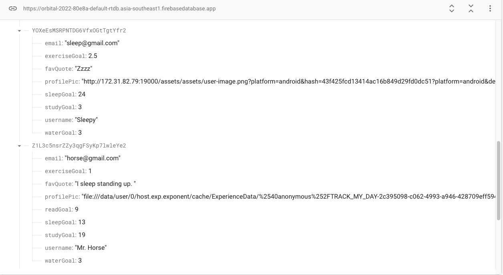
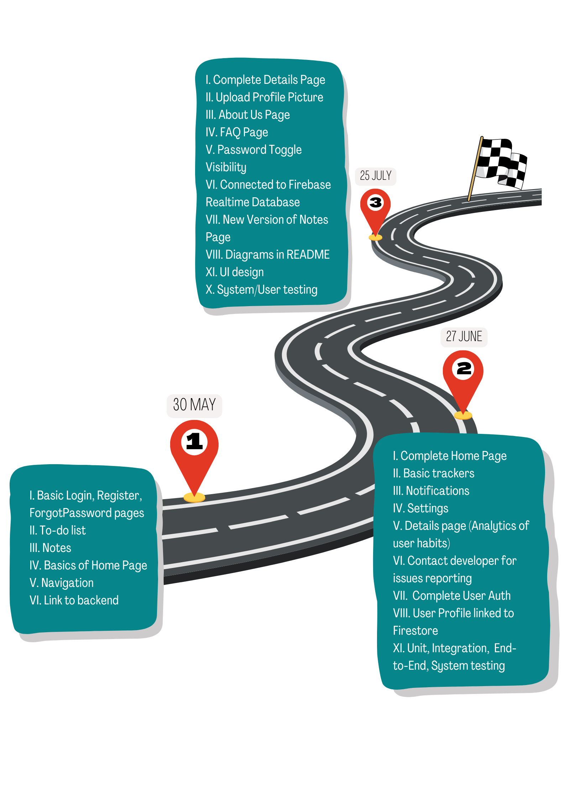

# NUS ORBITAL PROJECT 2022 - Track My Day 
### **An Orbital project by Cham Li Hui and Pwint Thiri Ko.**  
**[Github Repository](https://github.com/lihuicham/nus-orbital-project-2022)**    

**[Google Drive for Milestone 3](https://drive.google.com/drive/folders/1hbSiGgI8AQzhq_WigtTu3QDPAddWhNlb?usp=sharing)**  

**[Track My Day App Video 📺]()**  

Proof of Concept: **[Track My Day APK file]()** - please download it using your mobile device, you can access the file via our google drive (on your phone) and download it. It will show up as a mobile application on your phone screen. Click the app and try out Track My Day.  

**Sample account** with saved data for habits to display visualisation:  
email: hearts@gmail.com  
password: 123456  

_The profile picture is not going to appear on this account (we'll figure out how to fix it later!) but uploading a profile picture works. If you create a new account, you will be able to see a default profile picture and change it as well._

_Note:  
We recommend viewing our **GitHub README** for the latest update of the app.  
To view a collection of images, demo videos, project log, poster and full video of the app, visit our **Google Drive**. For best viewing experience (high resolution), watch the videos in full screen._
  
  # Table of Contents  
  - [What's new in Milestone 3?](#whats-new-in-milestone-3)
  - [Project Introduction](#project-introduction)  
      - [Team Information](#team-information)  
      - [Project Motivation](#project-motivation)  
      - [Aim & Vision](#aim--vision)  
      - [User Stories & Experience](#user-stories--experience)  
      - [Project Scope](#project-scope)
  - [Features](#features)  
      - [Authentication](#1-authentication)  
          - [Authentication](#authentication)  
          - [Login Page](#login-page)  
          - [Register Page](#register-page)  
          - [Forgot Password Page](#forgot-password-page)  
          - [Profile Page](#profile-page)  
          - [Delete Account](#delete-account)  
      - [Core Features](#2-core-features-of-app)  
          - [Tiles (Home Page)](#tiles-home-page)  
          - [Notes & To-Do List](#notes--to-do-list)  
          - [Drawer](#drawer)  
          - [User Details](#user-details)  
          - [Navigation](#navigation)  
          - [Settings](#settings)  
      - [Extended Features of App](#3-extended-features-of-app)  
          - [View Details Page](#view-details-page)  
          - [About Us Page](#about-us-page)  
          - [FAQ Page](#faq-page)  
          - [Notifications](#notifications)   
  - [Firebase Firestore (Database)](#firebase-firestore-database)  
      - [Structure of Data](#structure-of-data)  
      - [Create Data](#create-data)  
      - [Read Data](#read-data)  
      - [Update Data](#update-data)  
      - [Delete Data](#delete-data)  
  - [Firebase Realtime Database](#firebase-realtime-database)  
  - [Diagrams](#concept-diagrams)  
      - [Component Interaction](#component-interaction)  
      - [User Flow Map](#user-flow-map)
  - [Testing](#testing)  
      - [Unit Testing](#unit-testing)  
      - [Integration Testing](#integration-testing)  
      - [End-to-end (E2E) Testing](#end-to-end-e2e-testing)  
      - [System Testing](#system-testing)  
  - [Demo Video of Full App](#demo-video-of-full-app)  
  - [Timeline and Progress Chart](#timeline-and-progress-chart)  
  - [Project Log](#project-log)  
  - [Tech Stack](#tech-stack) 
  - [Software Engineering Practices](#software-engineering-practices)    
  - [Milestone 3 Poster](#milestone-3-poster)  
    
  

# What's New in Milestone 3?

# Project Introduction
## Team Information  
#### Team Name: **Track My Day** 
#### Team Number: **5295**  
#### Level of Achivement: **Apollo 11**  

## Project Motivation  
As students that utilize the chrome extension Momentum, we were inspired by Momentum’s concept and wanted to create an aesthetically pleasing dashboard to enhance user productivity. Initially, we were planning to create a chrome extension, but after further discussion, decided our ideas would be better suited for a mobile app. We wanted to create an app that is both functional and personalizable, such that users would use it daily to help them keep track of their habits and better organize aspects of their lives.

## Aim & Vision 
Track My Day is a mobile app with a primary focus on tracking habits, such as exercise, sleep and water consumption. We will be implementing additional features, namely, to-do lists and notepads that can be sorted easily. Track My Day will be personalized for each user and allows customisation based on users’ preferences. We envision Track My Day to be a convenient, all-in-one productivity app users can utilize on a daily basis, and the features were decided with this goal in mind.

## User Stories & Experience 
As a young adult who wants to transform into a better person, namely with good habits, I want a simple but aesthetically pleasing tracker that is able to assist me on that.  

As an individual who wants to improve efficiency, I want a tracker that can show me my progress for the habits that I wish to pick up in a simplest and most straightforward way.  

As a modern user of digital devices, I wish to see a simplistic and minimalistic design in productivity and self-improvement mobile apps.  

As a student who is always on the go, I want an app that can allow me to take down quick notes or checklists, and viewing them should be easy.  

As a user of productivity apps, I want to have an awesome user experience on such apps. Along with functional user interface and aesthetically pleasing design, these features will greatly motivate me to stick with my goals and habits.  

## Project Scope
Our Orbital project will be an application that can be run on mobile or tablet.
  
The scope of our project can be divided into 5 parts. Click the links to jump to each section. 

1. **[Authentication:](#1-authentication)** Authentication, Login, Registration, Forgot Password, Profile pages and Delete Account

2. **[Core Features:](#2-core-features-of-app)** Home page, Notes page, To-do list page, Drawer**, Navigation, Settings
3. **[Extended Features:](#3-extended-features-of-app)** Notification, View details (Calendar & Analysis), Share Your Progress  
4. **[Firebase Firestore (database):](#4-firebase-firestore-database)** Structure of Data, Create Data, Read Data, Update Data, Delete Data 
5. [**Testing:**](#5-testing) Unit, Integration, End-to-end (E2E), System, User Testing 

** _Note: Drawer includes user details, navigation tabs, report issues and log out._
  

# Features
## 1. Authentication 

### Authentication
The authentication features - Login, Logout, Register, Forgot Password, Reset Password  and Delete Account  of the app are linked to the firebase backend database. When a new user registers his/her email and password on the app, the database will keep a record of his/her email and password. User is able to use the correct email and password combination to login. Firebase Authentication will process respective actions when any of the authentication features are performed by the user. 

Restrictions: 
1. Users must enter a password that has at least 6 characters
2. Users cannot register with the same email and password for more than one time.
3. Users with incorrect email or password combinations will not be able to login. 
4. Users will be prompted to re-enter their password if the passwords do not match during registration.

Error messages will be shown on the phone screen when any of the restrictions are violated. 
Resetting the password also makes use of Firebase authentication and after a new password is set, the user can only log in with the new password.

**Current Progress:** Completed frontend UI and integration with Firebase Authentication database.  

**--> Watch a demo video of our authentication page: [Authentication](https://drive.google.com/file/d/1xWIzDYKHUzd6D6qKcYUCSQ4jK0D9KHmg/view?usp=sharing)**

### Login Page 
The login page is the first page the user is brought to upon opening the app. This page allows the user to switch to the Register page as well as the Forgot Password page. The eye icon allows toggling of password visibility.      

The user logs in using their email and password, and authentication is implemented as mentioned above. Upon logging in, the user will be brought to the Home page.  

**Current progress:** Complete.   

  

### Register Page
A new user registers using their email and password at the Register page. The repeat password field ensures that the user enters the correct password both times and an error message will appear if the passwords are different. This page also has eye icons for password visibility toggling.  

After registration, the user is guided to the Profile page to register their personal details which will be stored in the Firestore database.  

**Current progress:** Complete  

  

### Forgot Password Page 
The user enters their email in the Forgot Password page. This page has been linked to Firebase and the user receives an email with a link to reset their password. Upon resetting their password, the user can only login with the new password.  

**Current progress:** Complete.

**--> Watch a demo video of our Forgot Password page: [forgotPassword](https://drive.google.com/file/d/1R_w4zVejvdAYDRRyeUPJz_24s--Pl0rT/view?usp=sharing)** 

  

### Profile Page 
The app will also collect the user’s personal details and goals which will be used in the Analysis page. The user can set their username, birthday and enter a favorite quote here. They can also set goals such as amount of sleep per night, amount of water drunk per day and amount of time spent studying, exercising or reading daily.  

The user will only encounter this page once immediately after registration. After registration, the user will be guided to the Profile page where they fill in these details. Upon pressing the button to register, a pop up will appear to confirm that the user has registered their details. The user will be added into the Firestore database and Realtime Database with these details recorded. Afterwards, if the user wants to make any changes, they can do so in ‘Settings’ where a separate page is created for changing these details. Any updates will also be recorded in Firestore and Realtime Database.  

**Current progress:** Complete.  

  

### Delete Account
Users can delete their account in the app. There will be a red 'Delete Account' button at the Settings and when clicked, the users will have to log in again with the correct username and password for additional safety.  

After logging in, there will be an alert to remind the user that deleting the account is an irreversible action. If the user chooses to delete the account, the user will be removed from the Firebase Authentication, Firestore and Realtime Database.  

**Current progress:** Complete.

  

## 2. Core Features of App

### Tiles (Home Page)
The home page serves the main function of this app - tracking habits. The trackers include water tracker, sleep tracker, read tracker etc. We redesigned the home page in Milestone 2. We call the home page - “Tiles”, named according to the appearance and layout of the trackers in the home page.  

The trackers can have different units and maximum values e.g. 24 hours, 10 liters, 50 kilograms and so on. This allows the trackers to be flexible in tracking all sorts of habits. Other than default trackers, users can customize their own trackers too.  
We use a slider to increase the value of each tracker instead of a dropdown menu or a picker. The slider is included for the user to adjust the value. Each tracker has its own unit that is suitable for the habit that the tracker is tracking. This feature greatly enhances the user experience.  

There will also be a “View Details” button at the bottom right corner of each tile (habit tracker) and clicking it will navigate to the view details page of each tracker.  
When the user clicks the “Confirm” button, the value of each tracker will be recorded or “written” into our backend database (Firebase Firestore). More details about write, read and update in the following section - Firebase Firestore. 

*Note:  
**From The Ring to Tiles** - We understand that the changes in the layout of the home page is the biggest change in our app. Previously (in Liftoff and Milestone 1), we decided that the trackers should be designed as different proportions of a ring, and hence our home page will only contain “The Ring”.*  

*However, we tested the ring design, consulted the tutor from the UI/UX workshop and discussed between us, we decided that the ring design was limiting the number of habit trackers we can have on The Ring (home page). Since it is just a hollow circle shape (literally, a ring shape), it can only be divided into at most 5 sections if the user wishes to have an aesthetically pleasing UI. We experimented with more trackers, which simulated the real-life use of the app. However, The Ring became really messy and packed because each tracker shared a small chunk of the circle ring. This greatly impacted the UI and UX of the app, and limited the app’s habit tracking ability and deviated from the project’s purpose.*  

*Hence, we took a step back and redesigned the habit trackers and the home page. Going forward, we will be implementing the habit trackers as “tiles” in the home page.* 

**Current progress:** Basic habits - water, sleep, read, exercise and etc have been added to Tiles. All components - slider confirm button and view details button are completed. Integrated frontend (confirm button) with backend database (Firebase Firestore). Completed all working features and UI design.  

**--> Watch a demo video of Tiles: [Tiles 📺](https://drive.google.com/file/d/1qjN_XWHHIvRYA-MAlK9ewGo7MXftWZag/view?usp=sharing)**  

  

### Notes & To-Do List 
Notes & to-do lists are meant to satisfy the quick note taking needs of the users. Both pages support simple typing.  

As both pages are meant for simple note taking, we do not intend to add more features such as bolded / italic words, add a photo or link function. We wish to maintain the simplicity of the features and minimalistic design of  the app.  

Current progress: Both pages completed with full functions. 
 
#### Notes  
For notes, the user can add (save), edit and delete notes. When the “+” button at the bottom right corner is clicked, a new page (which is a modal) for adding & editing the notes will be visible. All notes are arranged in one screen and users can scroll to view their notes. Users can also choose to view the notes in “Full View” or “List View” (collapsed notes).  

**--> Watch a demo video of Notes: [Notes 📺](https://drive.google.com/file/d/1qhzXf-iBGun7XZjSQATp-M0N9kCZG8qk/view?usp=sharing)**  

  

 

#### To-Do List
Users can add a new todo item by typing in the text box and pressing the “+” button. Users can delete individual todo items by tapping on each of them.  

**--> Watch a demo video of To-Do List: [To-Do List 📺](https://drive.google.com/file/d/1qgq1DNexN3jURlnbD-Zb8ezk21bAvj7l/view?usp=sharing)**  

  

### Drawer 
Drawer can be viewed when the user swipe right on any of the screens or pages. The drawer consists of three sections - user details, navigation tabs, and footer. 

1. **User details:** It shows the user’s profile image, username, email and favourite quote. 
2. **Navigation tabs:** Home, Settings, About Us and FAQ. 
3. **Footer:** Report Issues (contact developers via email) and Log Out.  

Report Issues button will open the default mailing app on the user’s phone (e.g. Gmail or Outlook) and send an email titled “Issues With Track My Day” to the developer of this app.  

**Current Progress:** Navigation tabs are completed and working. Report Issue and Log Out button are completed and working. UI design of drawer completed.  

**--> Watch a demo video of Drawer: [Drawer 📺](https://drive.google.com/file/d/1qiom-aAh2lUH_4pg5RtMkqOxREYMw7xt/view?usp=sharing)**  

  

### User Details  
When a new accout is created, the default profile picture will be applied. The user can change their profile picture by clicking on the camera icon beside the profile picture.  

Whenever a user updates their email, username or favourite quote, it will be reflected in the drawer immediately.

### Navigation
Track My Day uses React Navigation package to navigate between different screens. The types of navigation we are using are: stack, drawer and material bottom tabs.  

1. **Stack navigation:** All buttons (e.g. to View Details button) 
2. **Drawer navigation:**  Home page (Tiles), Settings, About Us page, FAQ page, Log Out 
3. **Material Bottom tabs navigation:** Home page (Tiles), To-do page, Notes page 

**Current Progress:** Completed. Able to navigate between different pages. 

**--> Watch a demo video of Navigation: [Navigation 📺](https://drive.google.com/file/d/1qijlm3A3TTf4v0Yy_p9OZWEHRXnU3_ac/view?usp=sharing)**  

### Settings 
Like all apps, there must be a Settings button. Things that are included in Settings are: change personal details, change email and password, delete account and turn on/off notification. This page is heavily linked to Firebase and Firestore.  

The user will be prompted to log in again before they can perform critical actions such as changing email or password, or deleting their account. This is to ensure that the correct user is authorizing these actions. When changing their email, if the new email is already taken, the user will be informed via an error message and the change will not be carried out. Before account deletion, the user will be informed that the action is irreversible and they can choose to go back or proceed with the deletion.  

**Current Progress:** This page has the following sections: Notifications toggle on/off, Update personal details, Change email or password and Delete Account. All sections are complete except Notifications toggle.

**--> Watch a demo video of Settings: [Settings 📺](https://drive.google.com/file/d/1P72npPYSDLMmft3HQdRFFsz4LRE_oPin/view?usp=sharing)**  

  

## 3. Extended Features of App 

### View Details Page 
Once the user clicks the “View Details” button at the bottom right of the icon, the user will be directed to a details page. We include the following components in the “View Details” page.  

1. **Analytics:** Since habits are tracked in terms of days in Tiles, the data size collected for the habits are suitable for analysis. Here, the user can see the percentage of their goal that they have achieved so far.   

2. **Circular Progress Chart:** This animated chart shows how far the user has come in achieving their goal. The number in the middle of the ring is the average of their logged data (data for each day/number of days) whereas the entire ring adds up to their goal amount. For example, if the user's sleep goal is 8 hours, the ring will be complete at 8 hours. If the user has slept for 6, 7, 8 hours in the past 3 days, the number in the middle will show (6+7+8/3) = 7. The units will be in hours for sleep.

3. **Calendar:** Although our app tracks the daily progress of the user’s habits, we want a calendar to track the monthly progress of the user’s habits. Each day, a square will only be filled in when the user achieves their goal for the day. The calendar is designed for the visualization of the user’s progress and encourages the users to keep up with their streaks.   

4. **Chart:** We use a line chart that shows the user’s progress in tracking his/her water consumption habit for visualization of analytics. The data for the line chart is read from the Firebase Firestore.

**Current Progress:** Completed.

 

### About Us Page  
This page contains information about our motivations for creating Track My Day, what the user can do on the app and **links to our GitHub repository, Milestone poster and video as well as a blog post about our journey**.  

**Current Progress:** Completed.

**--> Watch a demo video of About Us Page: [About Us Page 📺]()**  

### FAQ Page  
Sometimes, users may have questions or suggestions to improve our app. The FAQ page uses bounce-in animation and contains answers to the most common questions. There is also a question on 'Need more help?' for users to reach out if the questions in the page do not adequately address the user's concern.  

**Current Progress:** Completed.  

**--> Watch a demo video of FAQ Page: [FAQ Page 📺]()**  

### Notifications 
We used local push notifications via Expo CLI for the app’s notification. The app will notify the user everyday at 9pm to use Track My Day.  

**Current Progress:** Completed. Toggling on/off is not yet complete.  

   

# Firebase Firestore (database)

### Structure of Data 

#### For Profile: 
- db/users/{userId} in Firestore database
- userId (string) = the randomly generated user.uid where user is the currently logged in user
- Collection: users ; Document: userId
- Each userId document field: birthday, exerciseGoal, favQuote, id, sleepGoal, studyGoal, username, waterGoal  

#### For View Details: 
- db/users/{userId}/habits/{habitName}/days/{dayId} in Firestore database
- habitName (string) = name of each habit, as shown in Tiles. Eg. READ, EXERCISE, WATER and etc. 
- dayId (string) = date of the day Eg. 20220624 for June 24, 2022. 
- Collection: users, habits, days ; Document: userId, habitName, dayId
- Each dayId document field: date, id, name, unit, value  

 

### Create Data 

#### For Profile: 
- When a new user registers their personal details, a document will be added to the users collection in Firebase with these details.
- The document ID for each new document is set as the currently logged in user’s ID in order to read, delete or update the user’s information which requires the document ID of the document the operation would be performed on. 
- User ID is also unique, meaning that each user will only have one document created for them.  

**--> Watch a demo video of Firestore User: [Firestore User 📺](https://drive.google.com/file/d/1zqaltEo0c0DqQUBuxWPkDJJ9SFnVFlkp/view?usp=sharing)**  

#### For View Details: 
- Add and update document, integrating frontend Tiles to backend database
- A new document of {dayId} will be created in the days collection when the user selects a value using the slider at Tiles. If the document is not created yet, a new document will be created as the user selects the value. If the document has been created (which means the user has selected a value before), the document will be updated with the new value when the user selects a new value using the same slider at Tiles. All documents are created specific for each habit tracked, with respective paths. 
- We use {dayId} for each document’s id for the easy retrieval of data to be used in other components. 
- _Note: Since the date of day is used as the document's id, it is unique. Hence, if a user changes the value within 24 hours, the same document will be updated and no new documents will be created._

### Read Data 

#### For Profile: 
- Data is retrieved from Firebase and is specific to each user

#### For View Details: 
- used in Analytics in “View details” page 
- Data is retrieved from Firestore and is specific to each habit, with their respective paths. 
- We use the “value” field in each document for analysis  

**--> Watch a demo video of Firestore Habits: [Firestore Habits 📺](https://drive.google.com/file/d/1mQhwyXvufG-RMuEUdkKmk4a4hg7tD5N_/view?usp=sharing)**  

### Update Data 

#### For Profile: 
- The user updates their personal details on a separate page under ‘Settings’. Clicking a specific update button will update the corresponding field in the Firebase database.
- The user will be prompted to sign in again before they can change their email address or password. Login rules are the same as in the Login page. The user’s email will be updated via Firebase authentication.

### Delete Data: 

#### For Profile: 
- Before an account can be deleted, the user has to sign in again to confirm their identity. A modal will pop up to allow this. Login rules are the same as in the Login page.
- Deleting an account will delete the user’s data from Firebase authentication as well as Firestore database.  

# Firebase Realtime Database  
When the user updates their details, such as email, username, favourite quote, and goals, the Realtime Database will track these changes.  

These changes can be read immediately and changes to email, username and favourite quote will be reflected in the drawer. Changes to goals will be used in the View Details page to calculate the user's progress.

## Concept Diagrams  
### Component Interaction  
This diagram shows the interaction of the files in the app.

### User Flow Map  
The User Flow Map depicts the possible actions a user can take in our app and the results.

# Testing 

### Unit Testing 
Note column:
1. Specific reason on testing (if not obvious)
2. Testing steps (if not obvious) 
3. Plan to improve (if pass)
4. Expected results (if fail)

### Integration Testing 

### End-to-end (E2E) Testing 

E2E Testing starts from the end user’s perspective and simulates real-world scenarios. This testing aims to validate the system under test and its components for integration and data integrity. 

### System Testing 
Types of Testing: 
 
  

Tested types of System Testing:  

### User Testing
To be completed in Milestone 3

## Demo Video of Full App 
**[Track My Day 📺]()**

## Timeline and Progress Chart

### Orbital 2022 Timeline 
**Liftoff:** 9 - 16 May 2022  
**Milestone 1:** 16 - 30 May 2022  
**Milestone 2:** 30 May - 27 June 2022  
**Milestone 3:** 27 June - 25 July 2022  
**Splashdown:** 25 July - 24 August 2022 

### Progress Chart of Track My Day 

### Project Log
Project Log provides description on the tasks distribution of Cham Li Hui and Pwint Thiri Ko and their respective time spent on developing the app.  

**[Read our Project Log](https://docs.google.com/document/d/1lzUOJ71JTVQP_y-cWFw_vw1JclCSUFteBu6YtgPo6-A/edit?usp=sharing)**

## Tech Stack  
We used these tools to create the project:  

- Development: React Native, React Native Navigation 
- Backend database: Firebase Authentication, Firestore, Firebase Realtime Database
- Languages: JavaScript, HTML, CSS  
- UI design: dopelycolors, icons8, OUCH
- Version Control: Git, GitHub 
- Software and Devices: Andriod, Expo Go 
- CLI: Expo  
- Poster & Video: Canva, Adobe Premiere Pro 

## Software Engineering Practices  
- Iterative development  
- Follow the 'KISS' principle  
- Readable code  
- Unit, Integration, E2E, System Testing  
- Error messages that are easy to understand  
- Presence of 'Cancel' and 'Back' buttons  
- Minimalistic design  
- Version control with Git  

## Milestone 3 Poster 

